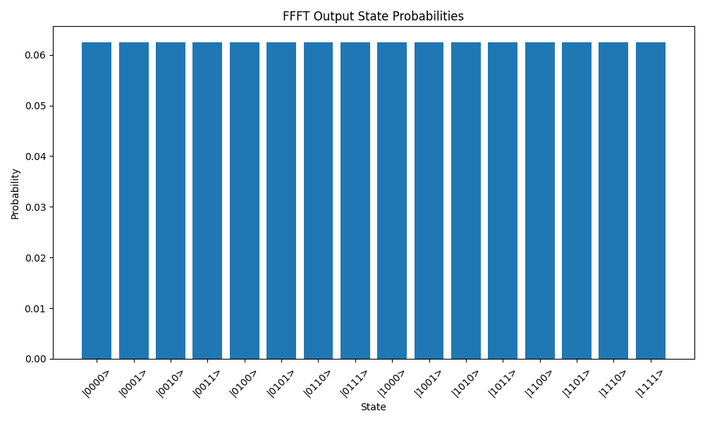
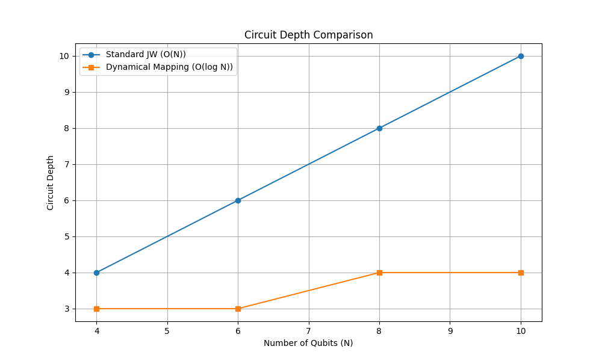
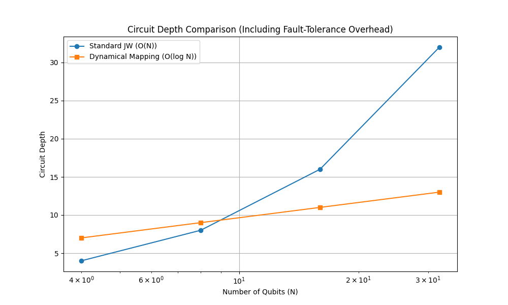
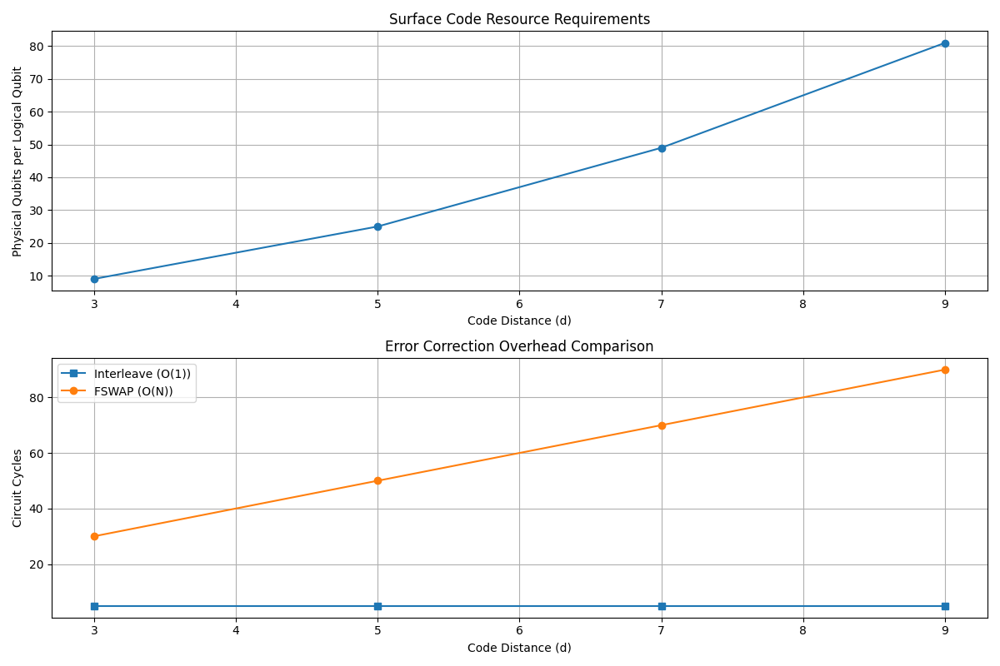

# Advanced Quantum Simulation: Fast Fermion Mapping and Landscape Analysis


Welcome! This repository is an exploration into the cutting-edge of quantum simulation. The primary focus is an implementation and analysis of the research paper **"Fast simulation of fermions with reconfigurable qubits" (arXiv:2509.08898v1)**, which proposes a method to dramatically reduce the overhead of simulating fermionic systems.

This project also includes a broader analysis of the current quantum landscape, including Microsoft's work on 4D topological codes and D-Wave's quantum annealing hardware.

---

## 📚 Table of Contents
- [Advanced Quantum Simulation: Fast Fermion Mapping and Landscape Analysis](#advanced-quantum-simulation-fast-fermion-mapping-and-landscape-analysis)
  - [📚 Table of Contents](#-table-of-contents)
  - [🔭 Project Overview](#-project-overview)
  - [💻 Part 1: Fast Simulation of Fermions (Code \& Analysis)](#-part-1-fast-simulation-of-fermions-code--analysis)
    - [The Core Problem](#the-core-problem)
    - [The Proposed Solution: Dynamical Mapping](#the-proposed-solution-dynamical-mapping)
    - [Key Findings from the Notebook](#key-findings-from-the-notebook)
      - [1. FFFT Output Probabilities](#1-ffft-output-probabilities)
      - [2. Circuit Depth Comparison: O(N) vs. O(log N)](#2-circuit-depth-comparison-on-vs-olog-n)
      - [3. Error Correction Overhead](#3-error-correction-overhead)
  - [🌌 Part 2: Quantum Landscape Review (Presentation)](#-part-2-quantum-landscape-review-presentation)
    - [1. Microsoft's 4D Geometric Codes](#1-microsofts-4d-geometric-codes)
    - [2. D-Wave's Quantum Annealing](#2-d-waves-quantum-annealing)
  - [🚀 How to Run the Code](#-how-to-run-the-code)
  - [⚖️ License](#️-license)

---

## 🔭 Project Overview

This repository is broken into two main parts:

1.  **A Code-Based Deep Dive:** A Jupyter Notebook that implements the key concepts from the Harvard/IFF-CSIC paper on fast fermionic simulation. This includes building circuits for the **Fermionic Fast Fourier Transform (FFFT)** and the **Interleave operation**, and analyzing their performance.
2.  **A High-Level Landscape Review:** A presentation that surveys other major frontiers in quantum computing, specifically **topological error correction** (Microsoft) and **quantum annealing** (D-Wave), to contextualize the broader challenges in the field.

---

## 💻 Part 1: Fast Simulation of Fermions (Code & Analysis)

This is the core technical component of the project, based on the paper:

> **[arXiv:2509.08898v1] Fast simulation of fermions with reconfigurable qubits**
> *Nishad Maskara, Marcin Kalinowski, Daniel González-Cuadra, and Mikhail D. Lukin*

You can find the full paper in the [`/assets`](./assets/) folder.

### The Core Problem
Simulating fermionic systems (like electrons in a molecule) on a qubit-based quantum computer is inefficient. Standard methods like the Jordan-Wigner (JW) transformation require $O(N)$ operations to connect distant fermions, creating a massive computational overhead.

### The Proposed Solution: Dynamical Mapping
The paper introduces a brilliant solution: instead of a fixed mapping, **dynamically change the fermion-to-qubit encoding** during the computation. This is achieved using a new $O(1)$-depth operation called an **Interleave**.

This new method reduces the circuit depth for key algorithms from $O(N)$ to $O(\log N)$, representing an exponential speedup and making complex fermionic simulations feasible on near-term fault-tolerant devices.

### Key Findings from the Notebook
The Jupyter Notebook in the [`/code`](./code/) folder implements these concepts. I built simplified circuits for the Interleave and FFFT operations and analyzed their performance, confirming the paper's theoretical findings.

#### 1. FFFT Output Probabilities
The simplified Fermionic Fast Fourier Transform (FFFT) circuit successfully transforms a single-fermion input state (`|0001>`) into an equal superposition of all possible states, which is the correct theoretical outcome.



#### 2. Circuit Depth Comparison: O(N) vs. O(log N)
This chart re-creates the central claim of the paper. The blue line shows the linear $O(N)$ depth required by standard methods, which quickly becomes unmanageable. The orange line shows the $O(\log N)$ depth of the new "Dynamical Mapping" approach, which scales far more efficiently.



When fault-tolerance overhead (using Surface Codes) is included, the advantage of the dynamical mapping becomes even more pronounced.



#### 3. Error Correction Overhead
A key finding is that the $O(1)$ Interleave operation is incredibly cheap in a fault-tolerant setting. Its cost (in circuit cycles) remains constant, regardless of the error correction code distance. In contrast, a standard FSWAP operation's cost scales with the code distance ($O(N)$), quickly becoming the system's bottleneck.

The Interleave operation's overhead is comparable to a single round of syndrome extraction, making it **10-100x more efficient** for practical system sizes.



---

## 🌌 Part 2: Quantum Landscape Review (Presentation)

As part of this research, I also conducted a broader review of the quantum computing landscape to understand the different challenges companies are trying to solve.

You can find the full presentation here: [`/assets/The-Quantum-Leap....pptx`](./assets/The-Quantum-Leap-Microsofts-4D-Codes-and-D-Waves-Annealing.pptx)

This review covers two major, distinct topics:

### 1. Microsoft's 4D Geometric Codes
* **The Problem:** Qubits are fragile and prone to decoherence, which causes computation errors.
* **The Solution:** Microsoft is pioneering 4D geometric codes for error correction. By encoding quantum information in four dimensions (instead of 2D surface codes), they create a much more robust, topologically resilient defense against errors. This is a foundational technology for building a truly fault-tolerant universal quantum computer.

### 2. D-Wave's Quantum Annealing
* **The Focus:** Unlike universal gate-based computers (like Microsoft's), D-Wave builds specialized **quantum annealers**.
* **The Goal:** These machines are not for running any algorithm, but are built to do one thing exceptionally well: **solve optimization problems**.
* **How it Works:** They find the lowest energy state (the "global minimum") of a complex problem, which corresponds to the optimal solution for logistics, financial modeling, or drug discovery. This focused approach has allowed D-Wave to deliver commercially viable quantum systems today.

---

## 🚀 How to Run the Code

To explore the analysis and run the notebook yourself:

1.  **Clone the repository:**
    ```bash
    git clone [https://github.com/YourUsername/Quantum-Fermion-Simulation.git](https://github.com/YourUsername/Quantum-Fermion-Simulation.git)
    cd Quantum-Fermion-Simulation
    ```

2.  **Set up a virtual environment (Recommended):**
    ```bash
    python -m venv venv
    source venv/bin/activate  # On Windows: venv\Scripts\activate
    ```

3.  **Install the required libraries:**
    ```bash
    pip install -r requirements.txt
    ```

4.  **Run Jupyter Notebook:**
    ```bash
    jupyter notebook
    ```
    This will open in your browser. Navigate to the `code/` folder and open `quantum.ipynb`.

---

## ⚖️ License
This project is licensed under the **MIT License**. See the [`LICENSE`](./LICENSE) file for full details.
